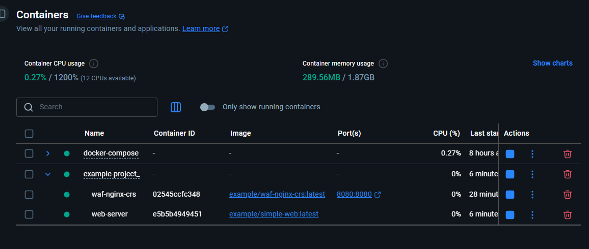
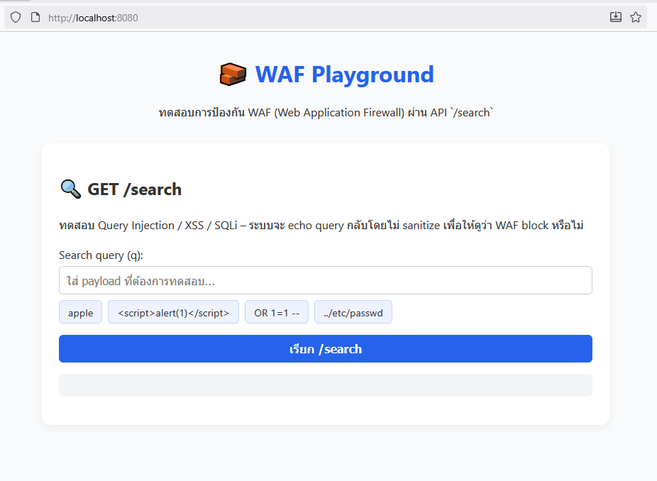
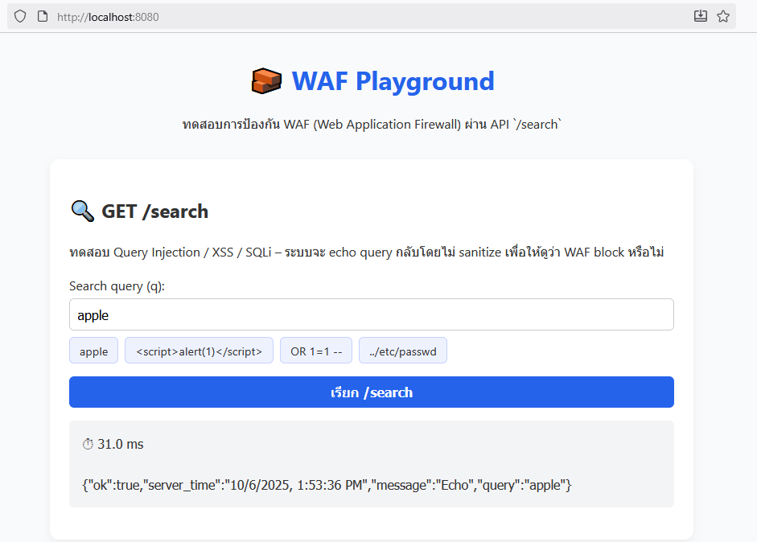
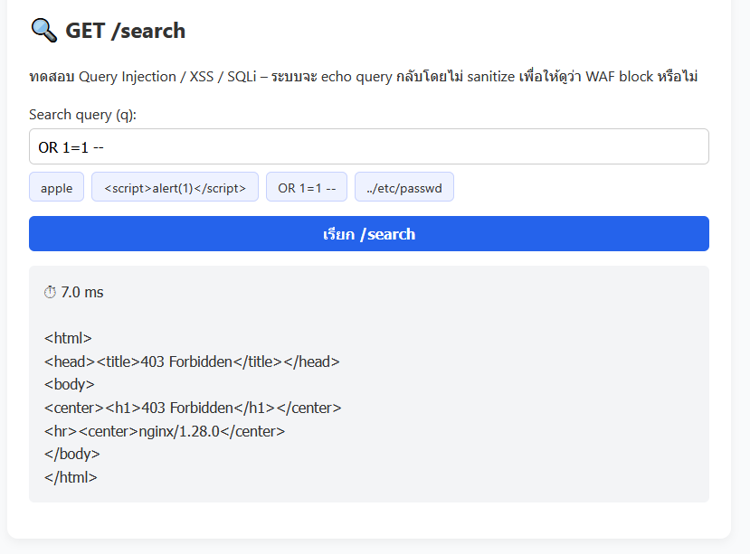
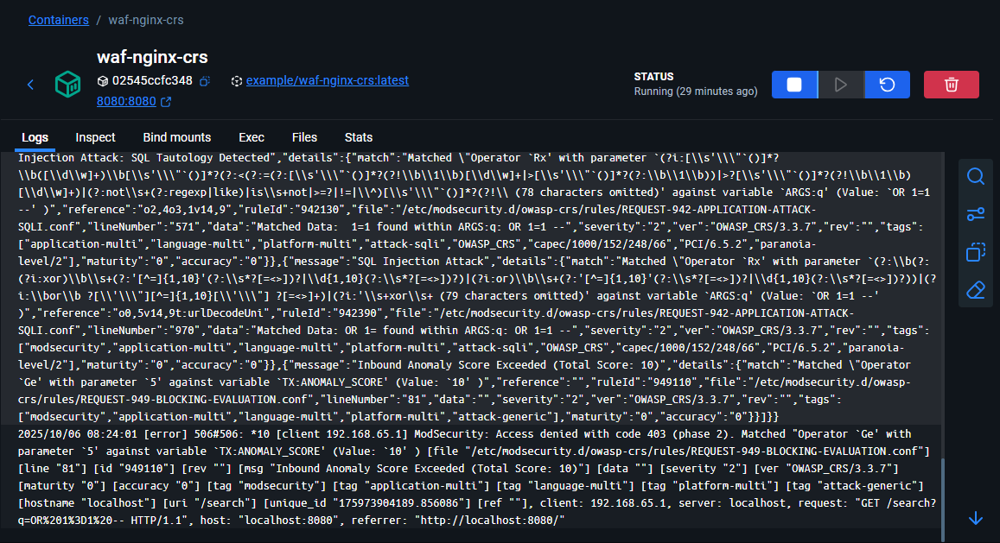

# รายงานการทดสอบ WAF

**ผู้จัดทำ:** 67130237:นายพิชเยนทร์ เย็นศิริ
**วันที่:** 2025-10-06

---

## สรุปการทดลอง
ทดสอบสแต็ก `OWASP ModSecurity CRS (nginx)` ที่ทำหน้าที่เป็น WAF แบบ reverse-proxy อยู่หน้าเว็บเซิร์ฟเวอร์ (static HTML / Node.js) โดยส่ง payloads ทดสอบ (SQLi / XSS / path traversal ฯลฯ) ผลลัพธ์ที่สำคัญคือ WAF สามารถจับและบล็อก payload รูปแบบ SQL injection และส่งกลับ **HTTP 403 Forbidden** พร้อมมีบันทึก ModSecurity (JSON-like audit log) ระบุ rule IDs ที่ถูกทริกเกอร์ (เช่น กลุ่ม 942xxx สำหรับ SQLi และ 941xxx สำหรับ XSS) รวมถึงการแจ้งเหตุการณ์ `Inbound Anomaly Score Exceeded` (rule 949110) ที่นำไปสู่การบล็อก

---

## สภาพแวดล้อมการทดสอบ
- ระบบรันด้วย `docker compose` (ไฟล์ `docker-compose.yaml`) มี 2 service หลัก:
  - `waf` — image: `example/waf-nginx-crs:latest` (จาก `owasp/modsecurity-crs:nginx` + template)
  - `web-server` — image: `example/simple-web:latest` หรือ `nginx:alpine` (static HTML variant)
- พอร์ตที่เปิด: **host:8080 -> container(waf):8080**
- WAF config ที่สำคัญ (env vars):
  - `BACKEND=http://web-server:3000` (หรือ 8081 ใน static variant)
  - `BLOCKING_PARANOIA=2`
  - `MODSEC_AUDIT_LOG_FORMAT=JSON`
  - `MODSEC_AUDIT_ENGINE=RelevantOnly`

---

## ขั้นตอนการทดสอบ (ที่ทำจริง) และ ผลการทดสอบ (หลักฐานจาก screenshot)
1. สั่ง `docker compose up --build -d`

2. ตรวจสอบสถานะคอนเทนเนอร์ (ตัวอย่าง UI screenshot ของ Cloud/Host Docker GUI) และยืนยันว่า `waf-nginx-crs` กำลังรัน


3. เปิดเบราว์เซอร์ที่ `http://localhost:8080/` เพื่อเข้าหน้า WAF Playground (หน้า HTML มีฟอร์ม `/search`)

4. ส่งคำขอทดสอบแบบ benign:
   ```bash
   curl -i 'http://localhost:8080/search?q=apple'
   ```
   - ผลลัพธ์: HTTP 200 พร้อม JSON echo ของ query
  
5. ส่งคำขอที่มี payload SQLi / XSS:
   ```bash
   curl -i "http://localhost:8080/search?q=' OR 1=1 --"
   curl -i "http://localhost:8080/search?q=<script>alert(1)</script>"
   ```
   - ผลลัพธ์คาดหวัง: HTTP 403 จาก WAF
  

---

## ผลการทดสอบเพิ่มเติม (หลักฐานจาก logs)
### 1) Logs จากคอนเทนเนอร์ `waf-nginx-crs`
ต่อไปนี้เป็น *transcribed* ข้อความสำคัญจาก log screenshot (เรียงตามลำดับข้อความที่เห็น):

```
"Injection Attack: SQL Tautology Detected","details":{"match":"Operator `Rx' with parameter ...","data":"Matched Data: 1=1 found within ARGS:q: OR 1=1 --","ruleId":"942130","file":"/etc/modsecurity.d/owasp-crs/rules/REQUEST-942-APPLICATION-ATTACK-SQLI.conf","lineNumber":"571","severity":"2","ver":"OWASP_CRS/3.3.7"}

... "ruleId":"942390","file":"/etc/modsecurity.d/owasp-crs/rules/REQUEST-942-APPLICATION-ATTACK-SQLI.conf","lineNumber":"970","data":"Matched Data: OR 1= found within ARGS:q: OR 1=1 --"

... "message":"Inbound Anomaly Score Exceeded (Total Score: 10)","ruleId":"949110","file":"/etc/modsecurity.d/owasp-crs/rules/REQUEST-949-BLOCKING-EVALUATION.conf","lineNumber":"81"

[error] 506#506: *10 [client 192.168.65.1] ModSecurity: Access denied with code 403 (phase 2). Matched "Operator `Ge' with parameter `5' against variable 'TX:ANOMALY_SCORE' (Value: '10') [file "/etc/modsecurity.d/owasp-crs/rules/REQUEST-949-BLOCKING-EVALUATION.conf"] [id "949110"] [msg "Inbound Anomaly Score Exceeded (Total Score: 10)"] ...
```

  
**สรุปจาก logs:**
- CRS rules ในกลุ่ม `REQUEST-942-APPLICATION-ATTACK-SQLI.conf` ถูกทริกเกอร์ (ตัวอย่าง ruleIds เช่น 942130, 942390 — บ่งชี้ pattern ของ SQL tautology / DB keywords)
- เมื่อคะแนนความผิดปกติรวม (anomaly score) สูงเกิน threshold (`TX:ANOMALY_SCORE` >= 5 ในการตั้งค่าเดิม) rule `949110` จะทำการบล็อก (HTTP 403)
- Log ระบุ client IP (`192.168.65.1`) และ request URI `/search?q=...` ซึ่งตรงกับการกระทำใน UI

---

## ข้อสังเกต / วิเคราะห์
1. **WAF ทำงานอย่างที่ควรจะเป็น:** ใส่ payload SQLi เช่น `' OR 1=1 --` แล้วโดนบล็อกเป็น 403 พร้อมบันทึก rule ของ CRS ที่เกี่ยวข้อง
2. **การบล็อกมาจากกลไกคะแนน (Anomaly Scoring):** Logs ระบุ `Inbound Anomaly Score Exceeded (Total Score: 10)` และ `Access denied with code 403` ซึ่งเป็นพฤติกรรมของ CRS แบบ default-blocking
3. **False positives & tuning:** การตั้งค่า `BLOCKING_PARANOIA=2` ทำให้ CRS ค่อนข้างระมัดระวัง — ถ้าแอปจริงมีพารามิเตอร์ที่มักมีคำที่ CRS ตรวจจับ อาจจำเป็นต้องเพิ่ม exclusion rules (REQUEST-900) หรือปรับ tuning เพื่อหลีกเลี่ยง false positives
4. **Audit log format = JSON:** เปิด `MODSEC_AUDIT_LOG_FORMAT=JSON` ทำให้เก็บข้อมูลในรูปแบบ parse-able, เหมาะกับการวิเคราะห์แบบอัตโนมัติ

---

## ผลสรุปสุดท้าย
การทดสอบยืนยันว่า **OWASP ModSecurity CRS** ที่ติดตั้งเป็น WAF แบบ reverse proxy สามารถตรวจจับและบล็อก payloads แบบ SQL injection และ XSS ในระดับมาตรฐานของ CRS (paranoia=2) ได้สำเร็จ โดยมี audit log ระบุ rule IDs ที่ถูกทริกเกอร์และเหตุผลของการบล็อก (anomaly score)

